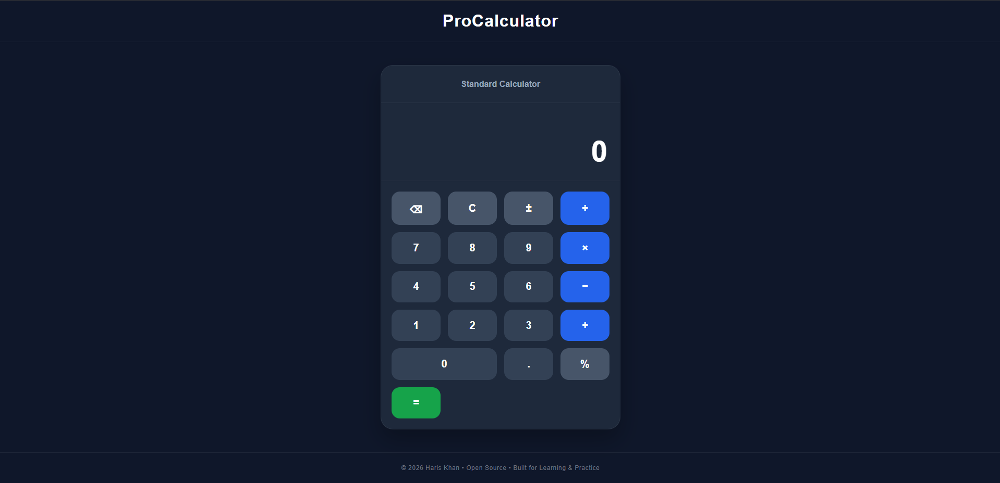

# 🧮 ProCalculator

A modern, responsive calculator built with **Python (FastAPI)**, **HTML5**, **CSS3**, and **Vanilla JavaScript**. The application delivers a clean user experience with fast calculations, responsive layouts, and a maintainable project structure.


---

## 📸 Preview

> Add screenshots after uploading them.

### Desktop

!


---

# ✨ Features

- Basic arithmetic operations
  - Addition
  - Subtraction
  - Multiplication
  - Division
- Decimal calculations
- Percentage calculations
- Positive / Negative toggle
- Backspace support
- Clear calculator
- Calculation history
- Automatic number formatting
- Responsive design
- Clean and modern UI
- Fast and lightweight

---

# 🛠 Tech Stack

## Backend

- Python
- FastAPI
- Uvicorn
- Jinja2

## Frontend

- HTML5
- CSS3
- Vanilla JavaScript

---

# 📂 Project Structure

```text
ProCalc-Web/
│
├── app/
│   ├── static/
│   │   ├── css/
│   │   │   └── style.css
│   │   ├── js/
│   │   │   └── script.js
│   │   └── images/
│   │       └── favicon.ico
│   │
│   ├── templates/
│   │   └── index.html
│   │
│   └── main.py
│
├── requirements.txt
├── README.md
└── .gitignore
```

---

# 🚀 Getting Started

## Clone the Repository

```bash
git clone https://github.com/Haris-Khan-pro/ProCalc-Web.git
```

```bash
cd ProCalc-Web
```

---

## Create a Virtual Environment

```bash
python -m venv .venv
```

Activate it

### Windows

```bash
.venv\Scripts\activate
```

### Linux / macOS

```bash
source .venv/bin/activate
```

---

## Install Dependencies

```bash
pip install -r requirements.txt
```

---

## Run the Application

```bash
uvicorn app.main:app --reload
```

Visit:

```
http://127.0.0.1:8000
```

---

# 🎮 Controls

| Control | Action |
|---------|--------|
| 0–9 | Numbers |
| + | Addition |
| − | Subtraction |
| × | Multiplication |
| ÷ | Division |
| . | Decimal |
| % | Percentage |
| ± | Toggle Sign |
| ⌫ | Delete Last Digit |
| C | Clear |
| = | Calculate |

---

# 📱 Responsive Design

The application is optimized for:

- Desktop
- Laptop
- Tablet
- Mobile

---

# 🏗 Architecture

```
Browser
      │
      ▼
HTML + CSS + JavaScript
      │
      ▼
FastAPI
      │
      ▼
Python Backend
```

---

# 🔮 Future Improvements

- Keyboard shortcuts
- Scientific calculator mode
- Memory functions (MC, MR, M+, M−)
- Dark / Light theme
- Calculation history panel
- Copy result
- Unit converter
- Currency converter

---

# 🤝 Contributing

Contributions are welcome.

1. Fork the repository
2. Create a feature branch

```bash
git checkout -b feature/new-feature
```

3. Commit your changes

```bash
git commit -m "feat: add new feature"
```

4. Push your branch

```bash
git push origin feature/new-feature
```

5. Open a Pull Request

---

# 📄 License

This project is licensed under the **MIT License**.

---

# 👨‍💻 Author

**Haris Khan**

GitHub: https://github.com/Haris-Khan-pro

---

## ⭐ Support

If you found this project helpful, consider giving it a **Star ⭐** on GitHub. It helps others discover the project and supports future development.

---

<p align="center">
  © 2026 Haris Khan • Open Source • Built for Learning & Practice
</p>